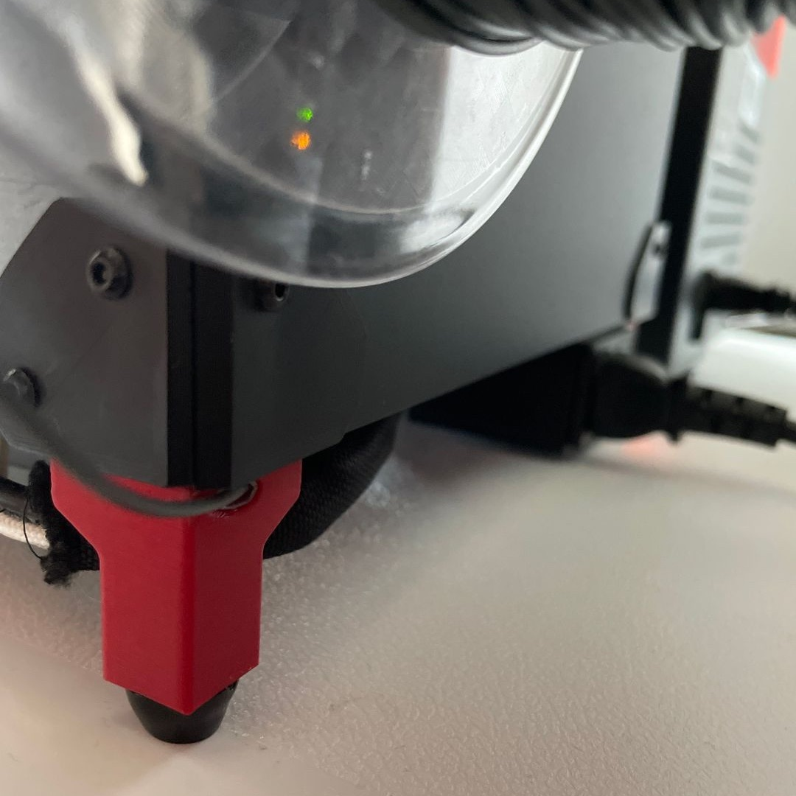

Flush bowden rear leg for V0
============================

This replaces the rear-right leg of the V0 or V0.1, removing the protruding bowen mount with a hole which aims directly behind the rear panel.

* Creates a slimmer look.
* Avoids knocking, and spinning, the leg when relocating the portable printer.
* Feeds more directly behind the rear panel.
* Extremely easy to install.

Considerations
--------------

* I chose to trim my bowden tubing at an angle so filament more easily travels through the opening.
* If you have the V0.2 this will not match the other legs. Use the previous STLs to make them all the same.  
→ https://github.com/VoronDesign/Voron-0/tree/108d12165d6cbb486b8bc874d380a8e3dd3c9fc1/STLs
